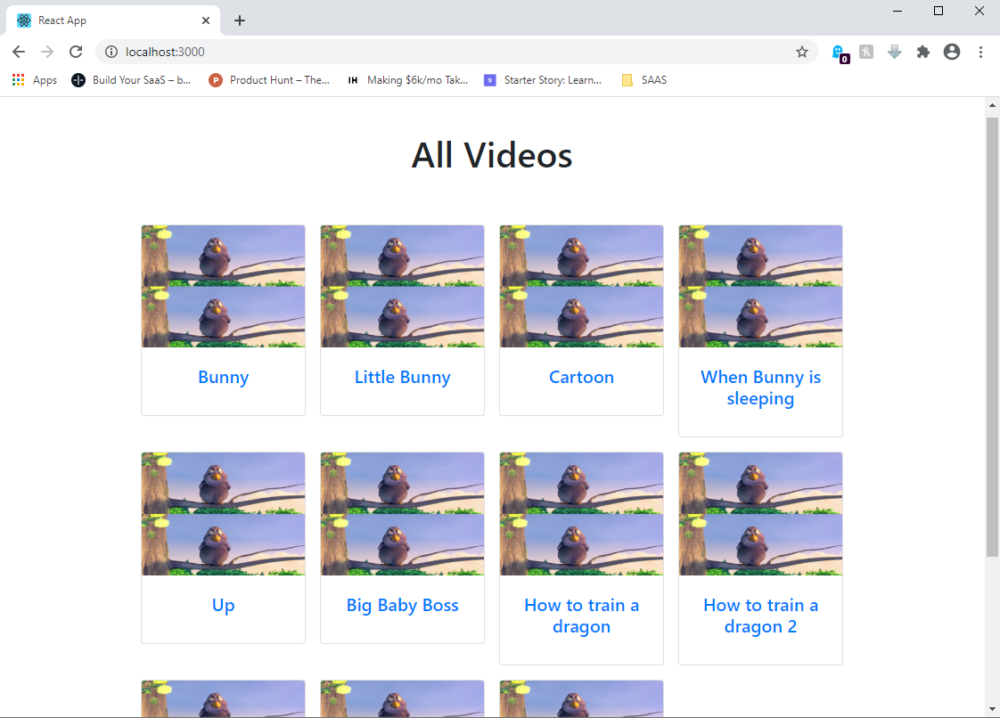

##Video Player
This project was built with React hooks and Node/Postgresql. The programming language is Typescript.

## Running the backend

### install npm packages

```sh
cd backend
npm install
```

### configure env file
Inside the env file configure the database variables. This project used postgresql

Example:
```
DB_NAME=video_test
DB_USERNAME=postgres
DB_PASSWORD=123456
DB_HOST=localhost
```

### run server

```sh
npm start
```

## Uploading the video
```sh
cd backend
npm run upload <filepath> <Video Title>
```

for example 
```sh
cd backend
npm install
npm run upload "1.mp4" "Funny Bunny Cartoon"
```

## Running the frontend

### install npm packages
```sh
cd frontend
yarn install
```

### run frontend
```sh
yarn start
```

## Screens

Show all videos


Show specific video

